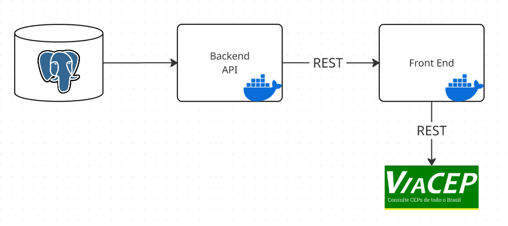

# PUC-Rio MVP FrontEnd


Microserviço com a interface gráfica que permite aos alunos da escola de beach tennis "Pé na Areia" consultarem as turmas disponíveis, realizar matrículas, consultarem em que turmas estão matriculados atualmente, alem de permitir o cancelamento da matrícula por parte dos alunos e a atualização das turmas disponíveis.

### Arquitetura do serviço web



A aplicação web responsável pelo cadastro e gerenciamento das matrículas é composta por um front-end desenvolvido em HTML, CSS e JavaScript, que se comunica com um back-end em Python com uma API REST em Flask. O front-end é responsável por fornecer uma interface amigável para os usuários, enquanto o back-end gerencia a lógica de negócios e a persistência dos dados.

### Execução da Aplicação

#### Usando Docker
Para executar a aplicação utilizando Docker:

```bash
# Construir a imagem
docker build -t pe-na-areia-frontend .

# Executar o contêiner
docker run -d -p 8080:80 pe-na-areia-frontend
```

Após a execução, acesse a aplicação em: http://localhost:8080

### Páginas disponíveis

#### 1. Home

    - Informações de localização e contato da escola

#### 2. Turmas disponíveis

    - Mostra informações sobre as turmas como horários, nível e nome do professor. Também dá a opção de atualizar informações da turma como horário, dia da semana e nível

#### 3. Matricule-se

    - Formulário a ser preenchido caso a pessoa queira se matricular em uma das turmas disponíveis

#### 4. Informações do Aluno

    - Consulta por CPF do aluno, em qual(is) turma(s) ele está matriculado atualmente. Permite ao aluno tambem que faça o cancelamento da matrícula.

### Integrações Externas

#### API ViaCEP

Esta aplicação utiliza a API pública ViaCEP para preenchimento automático de endereços no formulário de matrícula.

- **Endpoint**: `https://viacep.com.br/ws/{CEP}/json/`
- **Onde é utilizada**: No formulário de matrícula, quando o usuário insere um CEP válido, a aplicação consulta a API ViaCEP e preenche automaticamente os campos de endereço.
- **Funcionamento**: Ao digitar um CEP no campo correspondente, uma requisição AJAX é feita para a API ViaCEP, que retorna os dados de endereço em formato JSON.
- **Licença de uso**: A API ViaCEP é gratuita e de uso livre. Não requer autenticação ou API key para utilização. Para mais informações, consulte a [documentação oficial](https://viacep.com.br/).

